# NovaWorks CRM — AI Meeting to Project CRM

<p align="center">
  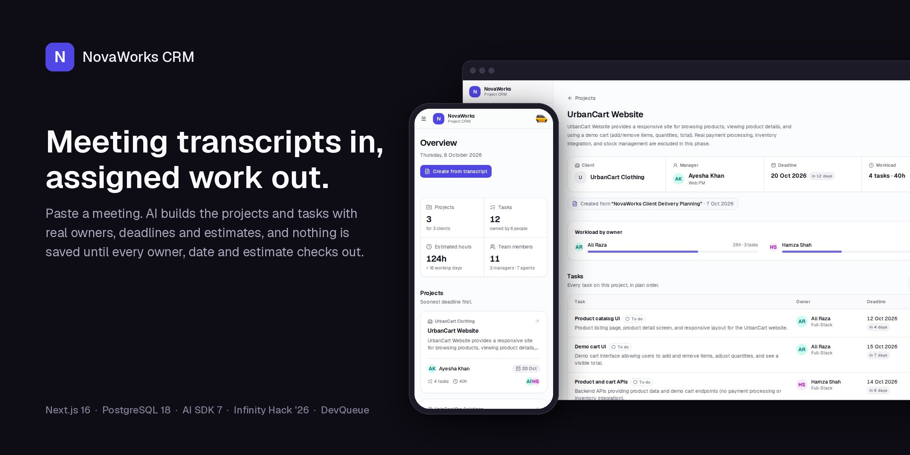
</p>

Paste a client-planning meeting transcript, and NovaWorks CRM uses AI to turn it into validated projects and tasks. Each one gets a manager, a client, a deadline, an owner and estimated hours. Admins, managers and agents each see only what their role allows.

**Live demo:** ran at novaworks.devqueue.co during Infinity Hack '26 (7 Oct 2026) and has since been retired. Run it locally with the steps below. **Demo password for all accounts:** `Demo123!`

## Screenshots

<table>
  <tr>
    <td width="50%" valign="top">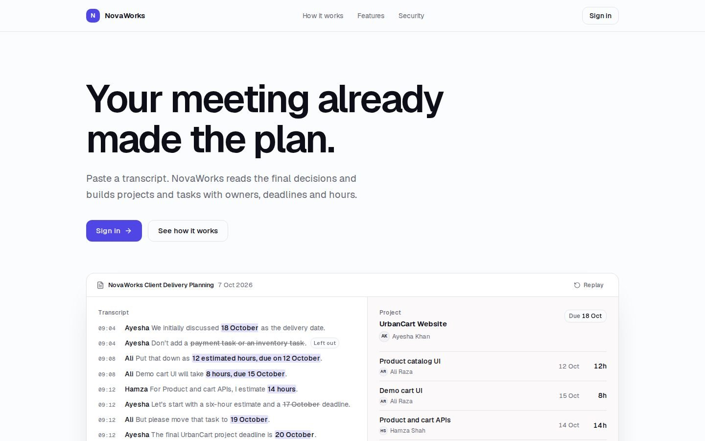<br><sub><b>Landing page</b>: the public product page, animated with GSAP</sub></td>
    <td width="50%" valign="top">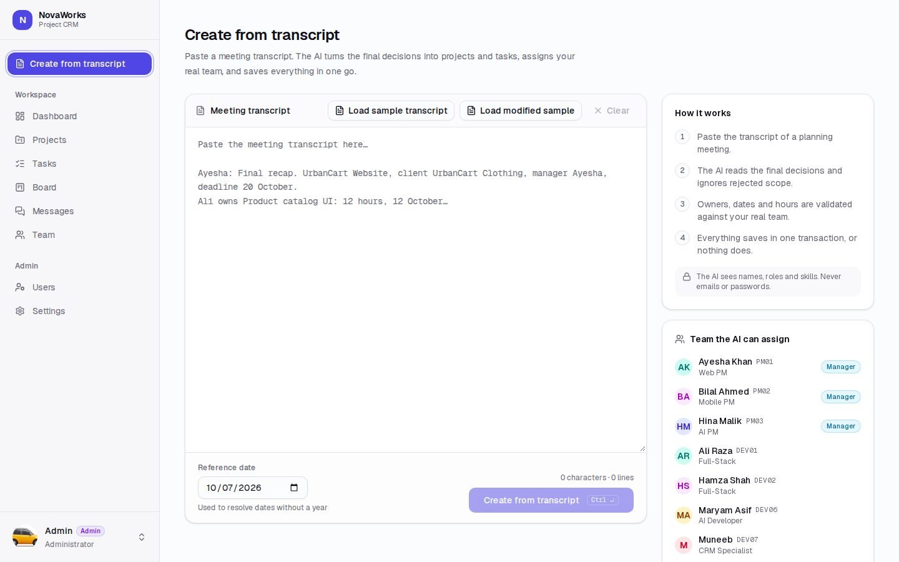<br><sub><b>Create from transcript</b>: paste a meeting and the AI drafts the plan</sub></td>
  </tr>
  <tr>
    <td width="50%" valign="top">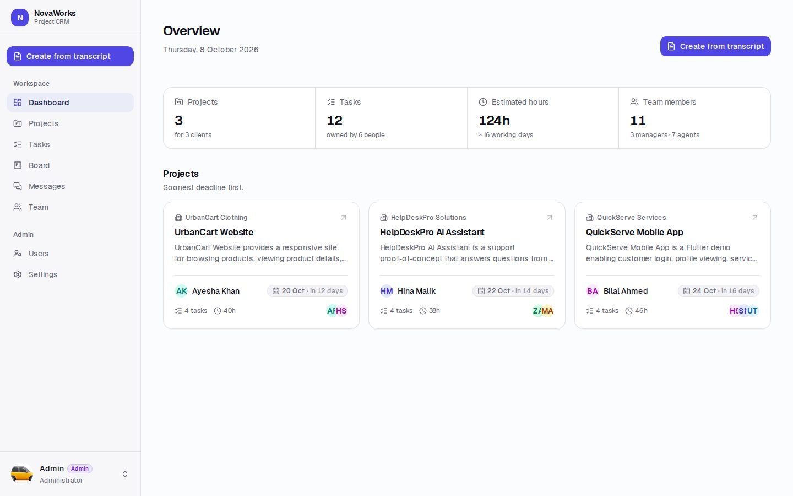<br><sub><b>Overview</b>: projects, tasks and estimated hours at a glance</sub></td>
    <td width="50%" valign="top">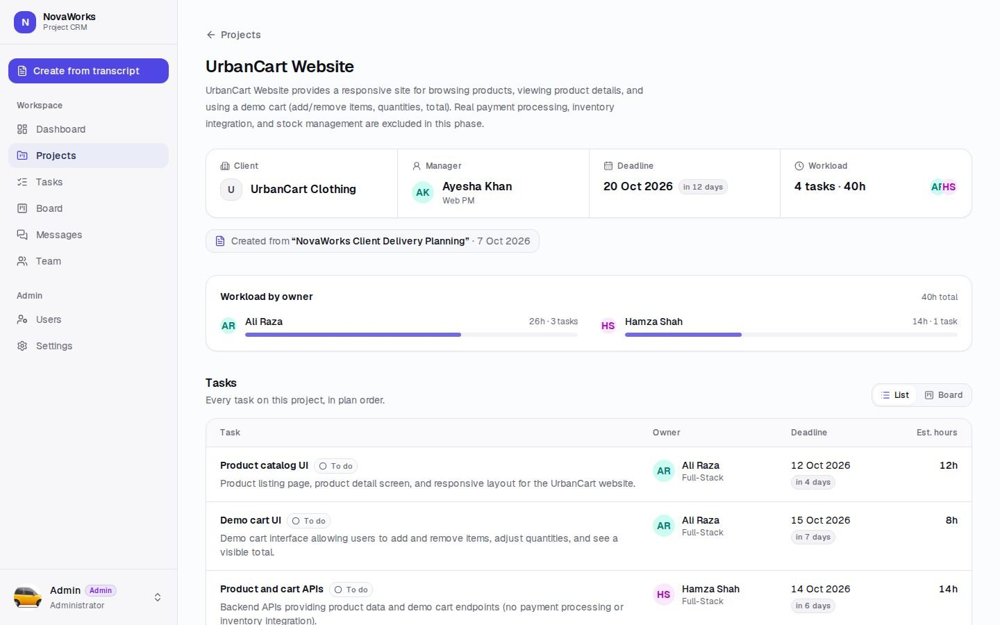<br><sub><b>Project</b>: client, manager, deadline, workload and every task</sub></td>
  </tr>
  <tr>
    <td width="50%" valign="top">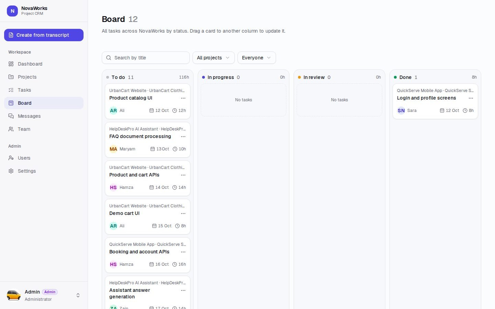<br><sub><b>Board</b>: drag-and-drop status columns with filters</sub></td>
    <td width="50%" valign="top">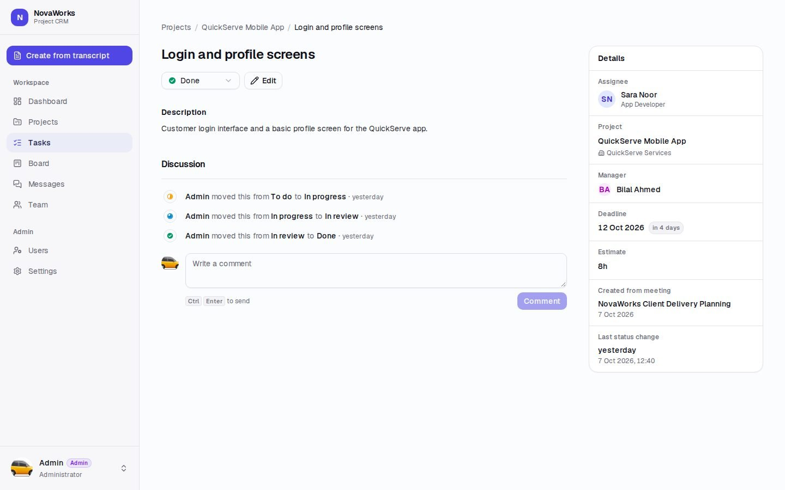<br><sub><b>Task</b>: status, details and a discussion thread</sub></td>
  </tr>
  <tr>
    <td width="50%" valign="top">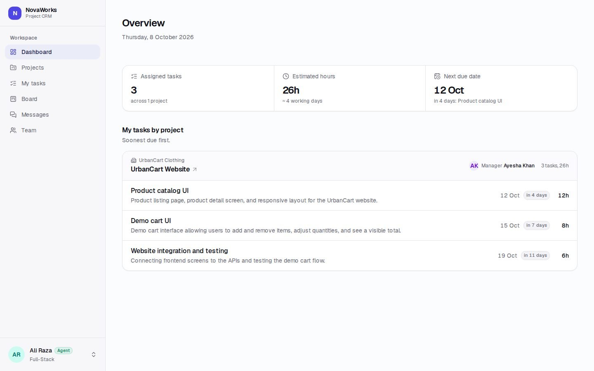<br><sub><b>Agent view</b>: each developer sees only their own work</sub></td>
    <td width="50%" valign="top">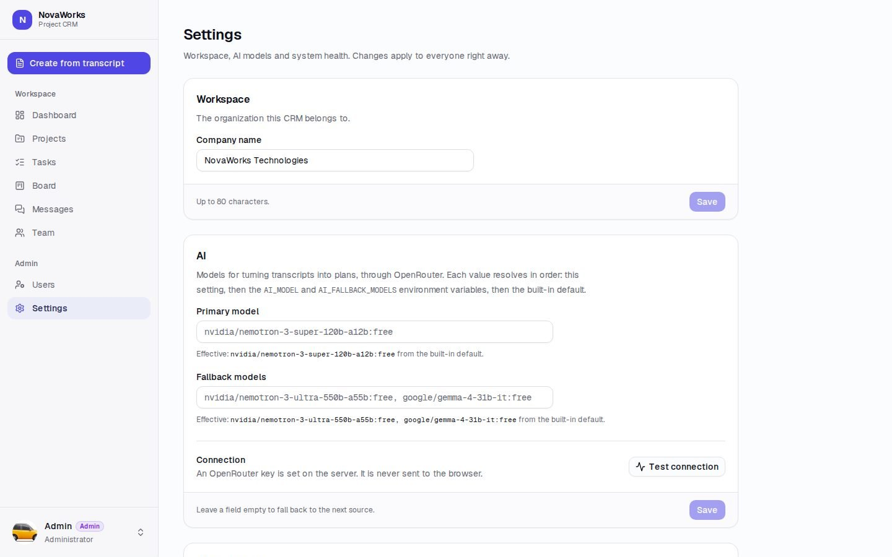<br><sub><b>Admin settings</b>: AI model, connection test and system health</sub></td>
  </tr>
  <tr>
    <td width="50%" valign="top">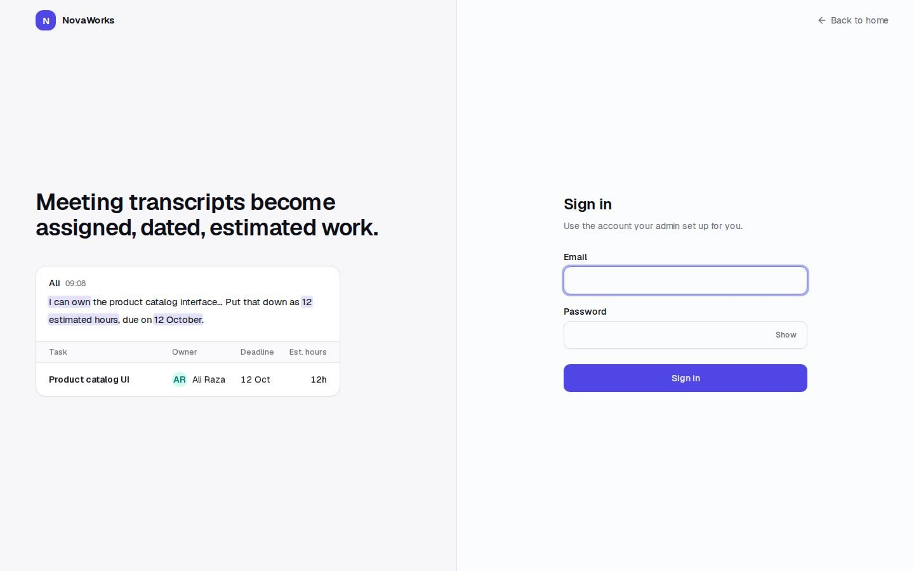<br><sub><b>Sign in</b>: light theme</sub></td>
    <td width="50%" valign="top">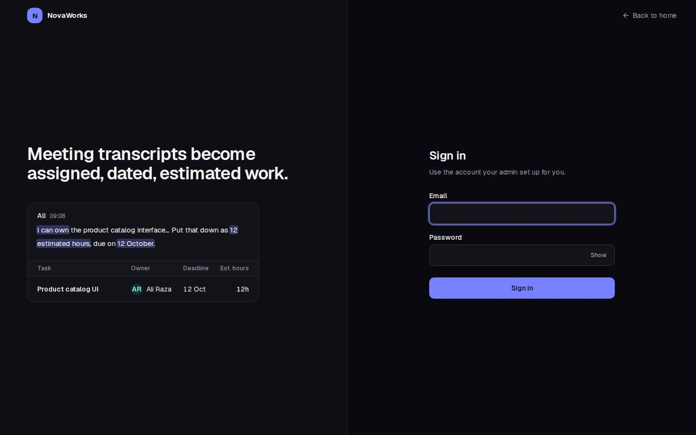<br><sub><b>Sign in, dark</b>: every screen supports dark mode</sub></td>
  </tr>
  <tr>
    <td colspan="2" align="center">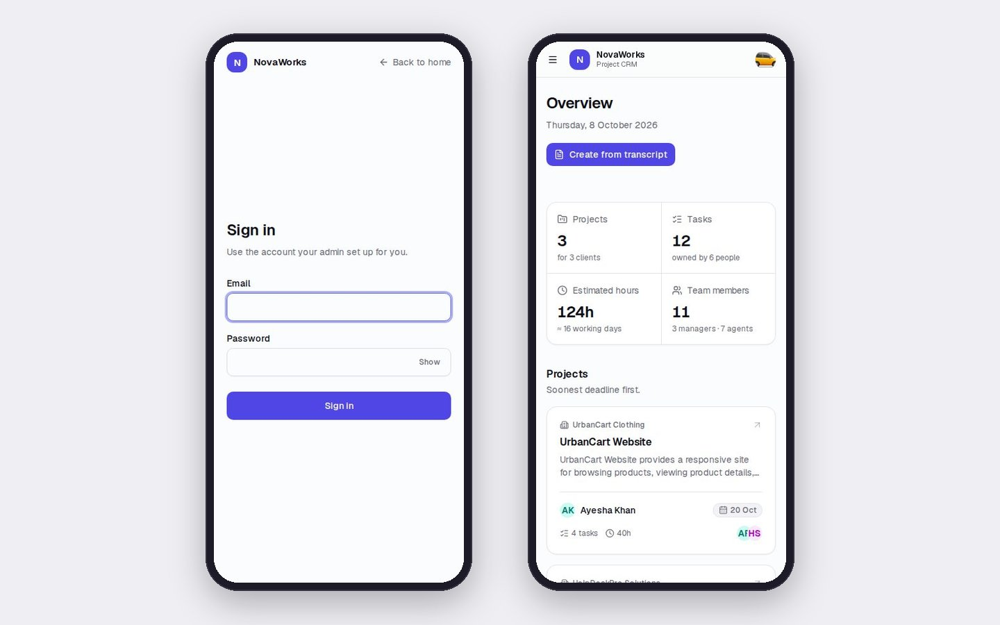<br><sub><b>Mobile</b>: sign in and the overview at 390px wide</sub></td>
  </tr>
</table>

## Team
- Team name: **DevQueue**
- Members:

  | Member | Roll no. | GitHub | Responsibilities |
  | --- | --- | --- | --- |
  | Muhammad Muneeb Shahzad | FA24-BSE-085 | [@VicegerentPrince](https://github.com/VicegerentPrince) | Architecture and backend: PostgreSQL schema and migrations, sessions and role-based access, AI transcript pipeline, VPS deployment (Docker, HTTPS) |
  | Abdullah Hassan | FA24-BSE-007 | [@abdullahhrajpoot](https://github.com/abdullahhrajpoot) | Product and QA: testing the role-based views and transcript imports, demo walkthrough and presentation, documentation review |

- Repository: https://github.com/DevQueueLab/novaworks-crm

## What Works
Everything in the brief works end to end. Nothing in the core flow is mocked.

| Area | What it does |
| --- | --- |
| **Seeded login** | All 10 demo accounts (1 admin, 3 managers, 6 agents) are seeded automatically. Login uses email + password with database-backed sessions. There is no signup or password reset, by design. |
| **Admin: transcript automation** | *Create from Transcript* sends the transcript to the AI, validates the draft and saves the meeting, clients, projects and tasks in a single transaction. *Load sample transcript* and *Load modified sample* are one-click buttons. A *Left out on purpose* list shows the scope the meeting rejected (payments, inventory, maps, real email). |
| **Admin: correction flow** | If the AI draft has a problem (unknown person, wrong role, bad date, task deadline after the project deadline, non-positive hours, duplicates), **nothing is saved**. The admin gets an editable form that re-validates before saving. |
| **Admin: re-import / sync** | Importing the same meeting again is idempotent. A modified transcript updates only the fields that changed, and the result screen shows field-level diffs (e.g. `10 h → 12 h`, `22 Oct → 23 Oct`). |
| **Manager view** | Project cards for the projects they manage, plus a project detail page with every task's owner, deadline, description and estimated hours. |
| **Agent view** | Only their own tasks, across every project they work on. |
| **Kanban board** | `/board` and a List/Board switch on every project: To do, In progress, In review and Done columns with drag-and-drop, filters and a *Move to* menu. Moves are permission-checked on the server (admin any task, managers their projects, agents their own). |
| **Task pages and discussion** | Every task opens on its own page with a status control, an edit drawer for the admin and the project's manager, and a discussion thread that mixes comments with an activity log of moves and edits. |
| **Team channels** | Slack-style `/messages`: `#general`, an automatic channel per project (visible only to that project's people) and channels anyone can create, with live updates. |
| **Admin: users and settings** | Create and edit users, change roles safely, reset passwords and deactivate accounts (signs them out everywhere). Settings for the company name, the AI model with a connection test, system health and a danger zone. |
| **Saved records** | Everything is stored in PostgreSQL and survives refreshes and restarts. Every import is kept as a `meetings` record for provenance. |
| **JSON API** | `GET /api/projects`, `GET /api/projects/:id` and `GET /api/tasks` follow the same per-role rules as the pages. Out-of-scope ids return **404**. |
| **Reset** | The admin *Reset demo data* button (or `pnpm db:reset-demo`) deletes generated data and keeps the seeded users. |

Not built, on purpose: inline editing of projects/tasks after creation, and deleting tasks that a re-import no longer mentions. See [Known Limitations](#known-limitations).

### Transcript → projects pipeline
1. The admin pastes the transcript (or clicks *Load sample transcript*).
2. The AI receives the transcript plus the **team directory**: code, name, role, specialization and skills. It never sees emails, passwords or database ids.
3. The model returns a **Zod-typed draft**, enforced as JSON-schema structured output. Models without native structured output go through a lenient JSON salvage path.
4. **Server-side validation** checks that:
   - each manager is a MANAGER and each task owner is an AGENT
   - dates are valid and no task deadline is later than its project deadline
   - hours are positive and there are no duplicates
5. Any issue → nothing is saved, and the admin fixes it in the correction form, which is validated again.
6. Otherwise, **one database transaction** saves the meeting, clients, projects and tasks. A Postgres advisory lock stops double submits from racing.
7. A re-import matches projects by *client + name* and tasks by *title*, so only what changed is updated and reported.

### Access control (enforced in SQL)
All reads go through one data-access layer, `src/lib/data/access.ts`, which adds the role filter to the SQL query itself. The current user always comes from the session, never from client input. `src/proxy.ts` only does optimistic redirects. The data layer is the real security boundary.

| Role | Projects visible | Tasks visible |
| --- | --- | --- |
| Admin | All | All |
| Manager | Projects they manage | Tasks in those projects |
| Agent | Only projects that contain their tasks | Only their own tasks |

## Technology Stack
- Frontend: **Next.js 16.3.8** (App Router, React Server Components, React Compiler, Turbopack), **React 19**, **TypeScript 5**, **Tailwind CSS 4 + shadcn/ui**
- Backend: the same Next.js 16.3.8 app on **Node.js 24 LTS**. It uses Server Actions for mutations and route handlers for the JSON API, with **Zod 4** validation. Package manager: **pnpm 11**.
- Database: **PostgreSQL 18.6**, **Drizzle ORM 0.45** + drizzle-kit SQL migrations, **postgres.js** driver
- AI: **OpenRouter** through **AI SDK 7** and the OpenRouter provider.
  - Default model: `nvidia/nemotron-3-super-120b-a12b:free` (native structured output).
  - Fallbacks: `nvidia/nemotron-3-ultra-550b-a55b:free`, then `google/gemma-4-31b-it:free`.
  - Configurable with `AI_MODEL` / `AI_FALLBACK_MODELS`.
- Authentication/session approach: **database-backed sessions**.
  - Login creates a random 256-bit token, stored in an `httpOnly`, `SameSite=Lax`, `Secure` cookie.
  - The `sessions` table stores only the token's **SHA-256 hash**. Sessions expire after 7 days.
  - Passwords are hashed with **Argon2id** (`@node-rs/argon2`). The "unknown email" path is timing-safe.
  - No session signing secret is needed.

### Data model (improvements over the handout schema)
Tables: `users`, `sessions`, `clients`, `meetings`, `projects`, `tasks` (see `src/db/schema.ts`).

- **uuidv7 primary keys** use PostgreSQL 18's native `uuidv7()`, so ids are time-ordered.
- **`code` column** (`ADMIN`, `PM01`…`PM03`, `DEV01`…`DEV06`): the AI refers to people only by code, never by database ids or emails.
- **Normalized `clients` table** instead of a free-text client name on each project.
- **The database enforces roles:**
  - `projects.(manager_id, manager_role='manager')` and `tasks.(assignee_id, assignee_role='agent')` are **composite foreign keys** to `users(id, role)`.
  - The database itself rejects a non-manager as project manager or a non-agent as task owner.
- **Check constraints:** hours must be positive and emails lowercase.
- **Case-insensitive unique indexes** on client name, *(client, project name)* and *(project, task title)*. These make re-imports idempotent.
- **`meetings` table:** every transcript import is kept for provenance. Projects link to their source meeting, and the summary JSON records what changed.

## Links
- Live application: retired after the hackathon (it ran at novaworks.devqueue.co on 7–8 Oct 2026)
- Demo video: not recorded; the live application above is the demo

## Requirements
- **Node.js 24 LTS** (`engines.node >= 24`)
- **pnpm 11** (`packageManager: pnpm@11.21.0`). Install with `npm install -g pnpm@11`.
- **Docker** with Compose v2, which runs PostgreSQL 18.6 for you. Any other **PostgreSQL 18+** works too (native `uuidv7()` needs 18) if you point `DATABASE_URL` at it.
- **OpenRouter API key** from https://openrouter.ai/keys. The free models work, and paid credits are recommended for reliability.
- Free local ports: **3000** (app) and **5433** (PostgreSQL)

## Run Locally
1. Clone this repository and enter its directory:
   ```sh
   git clone https://github.com/DevQueueLab/novaworks-crm novaworks-crm
   cd novaworks-crm
   ```
2. Install dependencies. Frontend and backend are one Next.js app, so there is a single install:
   ```sh
   pnpm install
   ```
3. Copy the provided `.env.example` to `.env.local`:
   ```sh
   cp .env.example .env.local
   ```
4. Set the environment variables in `.env.local`. Only `OPENROUTER_API_KEY` needs a real value. `DATABASE_URL` already matches the Docker database.
   ```sh
   OPENROUTER_API_KEY=sk-or-v1-...
   ```
5. Create and start the database: PostgreSQL 18.6 in Docker on `127.0.0.1:5433`, with a persistent named volume.
   ```sh
   docker compose up -d
   ```
6. Apply schema/migrations. This **runs automatically when the server starts** (`src/instrumentation.ts`). To run it explicitly:
   ```sh
   pnpm db:migrate
   ```
7. Seed all ten demo users. This also **runs automatically on server start**. To run it explicitly (it never creates duplicates):
   ```sh
   pnpm db:seed
   ```
8. Start backend and frontend (one process):
   ```sh
   pnpm dev
   ```
   Open **http://localhost:3000** and log in with any account below.

**Processes that must keep running:** the `pnpm dev` terminal and the Docker database container. The container runs in the background after `docker compose up -d`; stop it with `docker compose down`.

**Optional: run the production build locally.** This builds the same Docker image used in deployment and starts it with PostgreSQL. Stop `pnpm dev` first, because both use port 3000.
```sh
OPENROUTER_API_KEY=sk-or-v1-... docker compose --profile app up --build
# → http://localhost:3000 (migrations + seed run on container start)
```

## Environment Variables
| Variable | Purpose | Where configured |
| --- | --- | --- |
| `DATABASE_URL` | PostgreSQL connection string | Server only: `.env.local` (local), `/opt/novaworks/.env` (deployment) |
| `OPENROUTER_API_KEY` | AI provider credential (OpenRouter) | Server only: `.env.local` / deployment `.env` |
| `AI_MODEL` | Optional OpenRouter model id (default `nvidia/nemotron-3-super-120b-a12b:free`) | Server |
| `AI_FALLBACK_MODELS` | Optional comma-separated fallback model ids | Server |
| `APP_URL` | Public app URL, sent to OpenRouter as the referer | Server |
| `POSTGRES_PASSWORD` | Password for the PostgreSQL container | Deployment only: `/opt/novaworks/.env`, read by Docker Compose |

- No session secret is needed, because sessions are random tokens stored as SHA-256 hashes.
- No frontend API URL is needed, because the app is same-origin.
- There are **no `NEXT_PUBLIC_` variables**, so no secret ever reaches the browser.
- `.env.example` holds only placeholders. Real keys are never committed.

## Demo Login Accounts
These emails are fictional identifiers, not mailboxes. Signup, email verification, and forgot password are unnecessary.

| Role | Name | Demo email | Password |
| --- | --- | --- | --- |
| Admin | Admin | admin@novaworks.example | Demo123! |
| Manager | Ayesha Khan | ayesha@novaworks.example | Demo123! |
| Manager | Bilal Ahmed | bilal@novaworks.example | Demo123! |
| Manager | Hina Malik | hina@novaworks.example | Demo123! |
| Agent | Ali Raza | ali@novaworks.example | Demo123! |
| Agent | Hamza Shah | hamza@novaworks.example | Demo123! |
| Agent | Sara Noor | sara@novaworks.example | Demo123! |
| Agent | Usman Tariq | usman@novaworks.example | Demo123! |
| Agent | Zain Abbas | zain@novaworks.example | Demo123! |
| Agent | Maryam Asif | maryam@novaworks.example | Demo123! |

**Seeder:** the idempotent seeder runs **automatically every time the server or container starts**, together with migrations. You can also run it manually with `pnpm db:seed`. Re-running it never duplicates users.

## How Judges Can Test
1. Log in as **admin@novaworks.example** / `Demo123!` and open **Create from Transcript**.
2. Paste the supplied meeting transcript from [`samples/novaworks-meeting.md`](samples/novaworks-meeting.md), or click **Load sample transcript**.
3. Click create. Expect **three projects and twelve tasks** (table below).
4. Open **UrbanCart Website**: manager **Ayesha Khan**, deadline **20 October 2026**, four tasks.
5. Log out and log in as **Ayesha**. Only her assigned project (UrbanCart Website) should appear.
6. Log in as **Ali**. Only his three assigned UrbanCart tasks should appear.
7. Log in as **Hamza**. His two API tasks span UrbanCart (*Product and cart APIs*) and QuickServe (*Booking and account APIs*).
8. Check that other users' projects and tasks can't be fetched directly. Use the API while logged in as **Ali**:
   - `/api/projects` → only UrbanCart Website
   - `/api/tasks` → only his 3 tasks
   - `/api/projects/<QuickServe id>` → **404**. As admin, copy the id from the QuickServe project page URL or from `/api/projects`.
9. Refresh any page, or log out and back in. Everything persists because it is stored in PostgreSQL.
10. Test a modified transcript. As admin, click **Load modified sample** ([`samples/novaworks-meeting-modified.md`](samples/novaworks-meeting-modified.md)), then create.
    - In that sample, *Mobile integration and testing* changes to **12 h, due 23 Oct** (was 10 h, 22 Oct).
    - The result screen should show exactly that field-level diff. Still 3 projects / 12 tasks. QuickServe total: 46 h → 48 h.
    - Re-importing an unchanged transcript changes nothing.

**Expected result after the original transcript**

| Project | Client | Manager | Deadline | Tasks | Total hours |
| --- | --- | --- | --- | --- | --- |
| UrbanCart Website | UrbanCart Clothing | Ayesha Khan | 20 Oct 2026 | 4 | **40** |
| QuickServe Mobile App | QuickServe Services | Bilal Ahmed | 24 Oct 2026 | 4 | **46** (48 after the modified sample) |
| HelpDeskPro AI Assistant | HelpDeskPro Solutions | Hina Malik | 22 Oct 2026 | 4 | **38** |

<details>
<summary>All 12 expected tasks</summary>

| Project | Task | Owner | Hours | Due |
| --- | --- | --- | --- | --- |
| UrbanCart Website | Product catalog UI | Ali Raza | 12 | 12 Oct |
| UrbanCart Website | Demo cart UI | Ali Raza | 8 | 15 Oct |
| UrbanCart Website | Product and cart APIs | Hamza Shah | 14 | 14 Oct |
| UrbanCart Website | Website integration and testing | Ali Raza | 6 | 19 Oct |
| QuickServe Mobile App | Login and profile screens | Sara Noor | 8 | 12 Oct |
| QuickServe Mobile App | Service booking screens | Sara Noor | 12 | 17 Oct |
| QuickServe Mobile App | Booking and account APIs | Hamza Shah | 16 | 16 Oct |
| QuickServe Mobile App | Mobile integration and testing | Usman Tariq | 10 (12 modified) | 22 Oct (23 Oct modified) |
| HelpDeskPro AI Assistant | FAQ document processing | Maryam Asif | 10 | 13 Oct |
| HelpDeskPro AI Assistant | Assistant answer generation | Zain Abbas | 14 | 17 Oct |
| HelpDeskPro AI Assistant | Human escalation flow | Zain Abbas | 6 | 18 Oct |
| HelpDeskPro AI Assistant | Assistant evaluation and testing | Maryam Asif | 8 | 21 Oct |

</details>

**Resetting between tests (users are kept):**
- In the app: as admin, click **Reset demo data** on the Create from Transcript page.
- From the command line:
  ```sh
  pnpm db:reset-demo   # deletes generated projects, tasks and meetings; keeps the 10 seeded users
  ```

## Deployment Details
- Deployment status: **Retired** after the hackathon. It ran on our VPS at novaworks.devqueue.co on 7–8 Oct 2026; the setup below describes how it was deployed.
- Frontend host: a self-managed VPS (AlmaLinux 9, shared with other apps). The Next.js container `novaworks-web` sits behind OpenLiteSpeed (CyberPanel), which handles HTTPS with Let's Encrypt.
- Backend host: the **same Next.js app and container** as the frontend (Server Components, Server Actions and `/api` route handlers) at the same URL. There is no separate backend service.
- Database: **self-hosted PostgreSQL 18.6** (`postgres:18.6-alpine`) in container `novaworks-db` on the same VPS.
  - It is reachable only on the private Docker network, with no published port. Data lives on a named volume.
  - SSL isn't needed, because database traffic never leaves the host.
- Deployed branch/commit: `main` (latest commit)

### How We Deployed
1. **Build.** Build the image from the repo's multi-stage `Dockerfile`:
   ```sh
   docker build -t novaworks-web .
   ```
   The build uses `node:24-alpine`, runs `pnpm install --frozen-lockfile`, then `pnpm build` with `output: "standalone"`. The output in `.next/standalone` and `.next/static` goes into a small runtime image that runs as non-root, with a healthcheck on `/api/health`.
2. **Start.** In `/opt/novaworks`, start Docker Compose project `novaworks`:
   ```sh
   docker compose up -d
   ```
   - `novaworks-web` is published only on `127.0.0.1:4800`. The OpenLiteSpeed vhost for `novaworks.devqueue.co` terminates HTTPS and reverse-proxies to it.
   - Both containers have memory/CPU caps and log rotation, to stay good neighbours on the shared host.
3. **Database.** `novaworks-db` (`postgres:18.6-alpine`) runs in the same Compose project, with a named volume and no published port. The web container connects over the private Docker network, so no SSL is needed.
4. **Environment variables.** These live in `/opt/novaworks/.env` (owned by root, `chmod 600`, never in git):
   - `POSTGRES_PASSWORD`
   - `DATABASE_URL`
   - `OPENROUTER_API_KEY`
   - `AI_MODEL`
   - `AI_FALLBACK_MODELS`
   - `APP_URL=https://novaworks.devqueue.co`
5. **Migrations and seed** run **automatically on container start** (`src/instrumentation.ts` applies the bundled Drizzle migrations, then runs the idempotent seeder). No manual command is needed, and redeploys are safe.
6. **Frontend API URL / CORS:** not used. The browser only talks to `https://novaworks.devqueue.co`, which serves pages, Server Actions and the JSON API from one origin.
7. **For judges:** during the event, judges opened the deployment and logged in with any demo account (`Demo123!`). The deployment has since been retired; run the app locally with the steps above.

## Known Limitations
- **OpenRouter free-tier quota.** Free models allow about **50 requests/day per account** and may hit rate limits at peak times.
  - The app tries the fallback models in order.
  - For best reliability, set `AI_MODEL` to a paid OpenRouter model on an account with credits.
  - If the AI call fails, nothing is saved. Just retry.
- **No inline editing** of projects/tasks after creation. Changes go through the correction form or a re-import of an updated transcript.
- **Re-import sync is additive by design.** Tasks missing from a newer transcript are kept, not deleted.
- **Single admin.** There is no user management, signup or password reset (not required by the brief).
- Out of scope per the meeting, and listed in the app as *Left out on purpose*: payments, inventory, maps/driver tracking, real email/ticketing. Costs, progress tracking and charts were also excluded.

## Submission Summary
- Source repository: https://github.com/DevQueueLab/novaworks-crm
- Live link or local demo video: live deployment retired after judging (see Deployment Details)
- Setup and seed commands: documented above. In short: `pnpm install` → `cp .env.example .env.local` → `docker compose up -d` → `pnpm dev`. Migrations and seed run automatically, or use `pnpm db:migrate && pnpm db:seed`. Reset with `pnpm db:reset-demo`.
- Demo login accounts: all ten seeded automatically (password `Demo123!`), confirmed working.
- Features completed:
  - Seeded role-based login with database sessions
  - AI transcript → validated projects/tasks in one transaction
  - Correction form for invalid AI drafts
  - Idempotent re-import with field-level diffs
  - Manager project views and agent task views
  - Role-scoped JSON API (404 outside scope)
  - Database-enforced roles and constraints
  - Demo reset
  - Live HTTPS deployment
